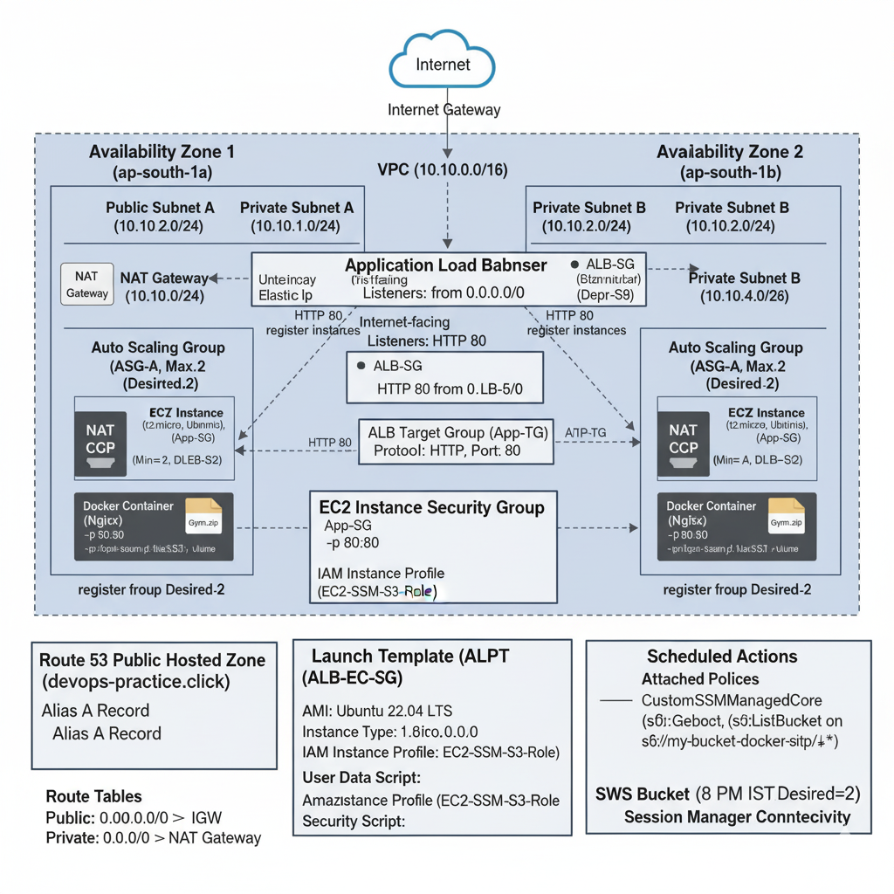

**This project is to create a AWS VPC with multi AZ support in mumbai region having public and private subnets. In Private subnets an nginx webserver is hosted as a docker container. This setup is managed by ASG and ALB. Along with it there is scale-in and scale-out feature. It creates a Launch template to spin ec2 instance base on that, a proper IAM role is attached to ec2 to access s3 and establish connectivity via session manager.**


    1. Create a VPC in CIDR 10.10.0.0/16 in mumbai region spread across 2 AZs

    2. Each AZ should have a private and a public subnet.

    3. A common NAT gateway for both public subnets.

    4. An ALB to handle traffic to ec2 instances on port 80 in private subnets, map the ALB to doamin "devops-practice.click"

    5. create a launch template based on below requirements and attach to an ASG which will scale to 0 between 8pm-6am IST everyday.

        1. In each private subnet there should an EC2 instance based on ubuntu t2.micro satifying  following condition

        2. create an user "my-user" and add it to sudoers list so that it has root access

        3. with this user install docker service and enable the docker service

        4. install ssm agent on this ec2 instance to enable connectivity via session manager

        5. create an IAM role to achieve below and attach to the ec2 instance:

            1. to give this EC2 access to s3 bucket s3://my-bucket-docker-site/gym-app/

            2. suitable policy to connect to this EC2 instance with session manager.

    6. copy from s3://my-bucket-docker-site/gym-app/Gym.zip

       unzip Gym.zip and copy contents to /home/my-user/apps/gym/

    7. install and run an nginx container as per below command


        `docker container run -d -v /home/my-user/apps/gym:/usr/share/nginx/html:ro --name=nginx-container1 --hostname=nginx-server -p80:80 nginx`


    8. these ec2 instances in private subnets only take in-bound http requests from ALB created in step 4 on port 80


-------------------------------------------------------
**Solution** 
=======================================================

#### This process involves several interconnected AWS services, including VPC, EC2, IAM, S3, Application Load Balancer (ALB), Route 53, Auto Scaling Group (ASG), and Systems Manager (SSM).

Below are the step-by-step instructions to achieve the desired architecture.

-----

## 1\. VPC and Subnet Setup

All steps should be performed in the **Mumbai region (ap-south-1)**.

1.  **Create a VPC:**
      * Create a VPC with the CIDR block **$10.10.0.0/16$**.
2.  **Identify Availability Zones (AZs):**
      * Choose two Availability Zones in the Mumbai region (e.g., `ap-south-1a` and `ap-south-1b`).
3.  **Create Subnets (4 total):**
    | Name | AZ | CIDR Block | Type |
    | :--- | :--- | :--- | :--- |
    | Public-A | `ap-south-1a` | $10.10.1.0/24$ | Public |
    | Private-A | `ap-south-1a` | $10.10.2.0/24$ | Private |
    | Public-B | `ap-south-1b` | $10.10.3.0/24$ | Public |
    | Private-B | `ap-south-1b` | $10.10.4.0/24$ | Private |
      * Ensure **"Auto-assign public IPv4 address"** is **enabled** for both **Public** subnets.
4.  **Create Internet Gateway (IGW):**
      * Create an IGW and **attach it to your VPC**.
5.  **Create Route Tables:**
      * **Public Route Table:** Add a route to the IGW for all external traffic ($0.0.0.0/0 \rightarrow IGW$). **Associate** this route table with **Public-A** and **Public-B** subnets.
      * **Private Route Table:** A default main route table is sufficient for now, as private subnets will route to the NAT Gateway for outbound traffic.

-----

## 2\. NAT Gateway Setup

1.  **Allocate Elastic IP (EIP):**
      * Allocate a single **Elastic IP address** (EIP) in the EC2 dashboard.
2.  **Create NAT Gateway (NAT GW):**
      * Create a **NAT Gateway** in **Public-A** subnet.
      * Associate the EIP allocated in the previous step.
3.  **Update Private Route Table:**
      * **Modify the Private Route Table** (or create a new one and associate it with Private-A and Private-B).
      * Add a route for all external traffic ($0.0.0.0/0 \rightarrow NAT-GW$) pointing to the single NAT Gateway created in step 2.

-----

## 3\. IAM Role for EC2 Instances

1.  **Create an IAM Policy (EC2-SSM-S3-Policy):**

      * This policy grants permissions for **Session Manager (SSM)** connectivity and read-only access to the specified S3 path.
      * **SSM Permissions:** Use the AWS managed policy **`AmazonSSMManagedInstanceCore`**.
      * **S3 Permissions:** Create a custom statement for S3.

    <!-- end list -->

    ```json
    {
        "Version": "2012-10-17",
        "Statement": [
            {
                "Effect": "Allow",
                "Action": [
                    "s3:GetObject",
                    "s3:GetObjectVersion"
                ],
                "Resource": "arn:aws:s3:::my-bucket-docker-site/gym-app/*"
            },
            {
                "Effect": "Allow",
                "Action": [
                    "s3:ListBucket"
                ],
                "Resource": "arn:aws:s3:::my-bucket-docker-site",
                "Condition": {
                    "StringLike": {
                        "s3:prefix": "gym-app/*"
                    }
                }
            }
        ]
    }
    ```

2.  **Create an IAM Role (EC2-SSM-S3-Role):**

      * Create an **IAM Role** for **EC2**.
      * Attach the AWS managed policy **`AmazonSSMManagedInstanceCore`** and the custom policy **`EC2-SSM-S3-Policy`** created above. This role will be the **Instance Profile**.

-----

## 4\. EC2 Launch Template and User Data

This section combines the instance requirements (User, Docker, SSM Agent, S3 file copy, Nginx container) into an EC2 **User Data** script.

1.  **Create Launch Template:**

      * Go to **EC2** $\rightarrow$ **Launch Templates** $\rightarrow$ **Create launch template**.
      * **AMI:** Select an **Ubuntu Server** AMI (e.g., Ubuntu 22.04 LTS).
      * **Instance Type:** **t2.micro**.
      * **Key pair:** Choose an existing key pair or proceed without one (SSM is used for connectivity).
      * **Network settings:**
          * **VPC:** Select your new VPC ($10.10.0.0/16$).
          * **Subnet:** **DO NOT** specify a subnet (ASG handles this).
          * **Security Group (ALB-SG):** Create a new **Security Group** for the EC2 instances in the private subnet:
              * **Inbound rule:** Type: **HTTP (Port 80)**. Source: **Security Group of the ALB** (you'll update this later, or use $0.0.0.0/0$ temporarily if you can't create the ALB's SG yet, but **update it later** to the ALB's SG ID).
              * **Outbound rule:** **All Traffic**, **$0.0.0.0/0$** (needed for NAT Gateway access).
      * **Advanced details:**
          * **IAM instance profile:** Select the **EC2-SSM-S3-Role** created in step 3.
          * **User data:** Use the following bash script:

    <!-- end list -->

    ```bash
        #!/bin/bash
        # Step 1: Create user "my-user" and add to sudoers
        sudo useradd -m my-user
        echo "my-user ALL=(ALL) NOPASSWD: ALL" | sudo tee /etc/sudoers.d/my-user
        sudo usermod -aG sudo my-user

        # Step 2: Install Docker
        sudo apt-get update -y
        sudo apt install -y unzip
        sudo apt-get install -y ca-certificates curl gnupg lsb-release
        sudo mkdir -p /etc/apt/keyrings
        curl -fsSL https://download.docker.com/linux/ubuntu/gpg | sudo gpg --dearmor -o /etc/apt/keyrings/docker.gpg
        echo \
        "deb [arch=$(dpkg --print-architecture) signed-by=/etc/apt/keyrings/docker.gpg] https://download.docker.com/linux/ubuntu \
        $(lsb_release -cs) stable" | sudo tee /etc/apt/sources.list.d/docker.list > /dev/null
        sudo apt-get update -y
        sudo apt-get install -y docker-ce docker-ce-cli containerd.io docker-compose-plugin

        # Step 3: Enable Docker service
        sudo systemctl enable docker
        sudo usermod -aG docker my-user

        # Step 4: Install and enable SSM Agent (Pre-installed on many recent AMIs, but good to ensure)
        # Check if SSM agent is running, if not, install
        if ! systemctl status amazon-ssm-agent; then
            sudo snap install amazon-ssm-agent --classic
            sudo systemctl enable snap.amazon-ssm-agent.amazon-ssm-agent.service
            sudo systemctl start snap.amazon-ssm-agent.amazon-ssm-agent.service
        fi

        # Step 5: Install AWS CLI (needed for s3 copy)
        curl "https://awscli.amazonaws.com/awscli-exe-linux-x86_64.zip" -o "awscliv2.zip"
        unzip awscliv2.zip
        sudo ./aws/install
        aws --version

        # Step 6: Copy from S3, unzip, and move contents
        sudo mkdir -p /home/my-user/apps/gym/
        sudo chown -R my-user:my-user /home/my-user/

        # Assuming the s3 object is public or the IAM role is correct
        sudo -H -u my-user aws s3 cp s3://my-bucket-docker-site/gym-app/Gym.zip /tmp/Gym.zip
        sudo -H -u my-user unzip /tmp/Gym.zip -d /home/my-user/apps/gym/
        sudo rm /tmp/Gym.zip

        # Step 7: Install and run Nginx container
        # Run as root user to ensure docker command works after initial setup and before my-user logs in
        sudo docker container run -d \
        -v /home/my-user/apps/gym/Gym:/usr/share/nginx/html:ro \
        --name=nginx-container1 \
        --hostname=nginx-server \
        -p80:80 nginx
    ```

-----

## 5\. Application Load Balancer (ALB) Setup

1.  **Create Target Group (ALB-TG):**
      * Go to **EC2** $\rightarrow$ **Target Groups** $\rightarrow$ **Create target group**.
      * **Target type:** Instances.
      * **Protocol/Port:** **HTTP**, **80**.
      * **VPC:** Select your new VPC.
      * **Health checks:** **HTTP** on path `/` (or relevant path).
2.  **Create ALB:**
      * Go to **EC2** $\rightarrow$ **Load Balancers** $\rightarrow$ **Create load balancer**.
      * Select **Application Load Balancer**.
      * **Scheme:** **Internet-facing**.
      * **VPC:** Select your new VPC.
      * **Mappings:** Select **Public-A** and **Public-B** subnets.
      * **Security Group (ALB-SG):** Create a new **Security Group** for the ALB:
          * **Inbound rule:** Type: **HTTP (Port 80)**. Source: **$0.0.0.0/0$**.
          * **Outbound rule:** **All Traffic**, **$0.0.0.0/0$**.
      * **Listeners and routing:**
          * **Protocol:** **HTTP**, **Port 80**.
          * **Default action:** Forward to the **ALB-TG** created above.

-----

## 6\. Auto Scaling Group (ASG) and Scheduled Scaling

1.  **Create Auto Scaling Group (ASG):**
      * Go to **EC2** $\rightarrow$ **Auto Scaling Groups** $\rightarrow$ **Create Auto Scaling group**.
      * **Launch template:** Select the template created in step 4.
      * **VPC:** Select your new VPC.
      * **Subnets:** Select the **Private-A** and **Private-B** subnets (this is where your EC2 instances will run).
      * **Load Balancing:** Attach the ASG to the **ALB-TG** created in step 5.
      * **Group size:** Set **Desired capacity = 2**, **Minimum capacity = 0**, **Maximum capacity = 2**. (Initial Desired set to 2 to launch instances right away, matching the 2 private subnets).
2.  **Configure Scheduled Scaling (Scale to 0 at night):**
      * In the ASG, go to **Automatic scaling** $\rightarrow$ **Scheduled actions** $\rightarrow$ **Create scheduled action**.
      * **Scale In (Nighttime Shutdown):**
          * **Name:** `Scale-In-Night`
          * **Min:** **0**
          * **Max:** 2
          * **Desired:** **0**
          * **Recurrence:** **$00 20 * * *$** (8:00 PM IST is 20:00 UTC+5:30, which is **2:30 PM UTC** if not using local time, or adjust for the region time, Mumbai is UTC+5:30. Let's use **20:00** IST in the ASG console, assuming it correctly handles the time zone or set for **$02 30 * * *$$$** UTC if using default. **Let's assume the ASG is set to use the region's timezone for simplicity in the console:** **$00 20 * * *$$** for 8:00 PM IST).
      * **Scale Out (Morning Start):**
          * **Name:** `Scale-Out-Morning`
          * **Min:** **2**
          * **Max:** 2
          * **Desired:** **2**
          * **Recurrence:** **$00 06 * * *$** (6:00 AM IST is 06:00 UTC+5:30, which is **12:30 AM UTC** if not using local time. **Set to $00 06 * * *$$** for 6:00 AM IST assuming region time).

-----

## 7\. Security Group Finalization

1.  **ALB-SG (Application Load Balancer Security Group):**
      * Inbound: Allow **HTTP (80)** from **$0.0.0.0/0$**.
2.  **ALB-TG-SG (EC2 Instance Security Group in Private Subnets - created as ALB-SG in step 4):**
      * Inbound: Allow **HTTP (80)** from the **ALB's Security Group ID** (e.g., `sg-xxxxxxxxxx`). This ensures only the ALB can communicate with the EC2 instances.

-----

## 8\. Map ALB to Domain

1.  **Route 53 Hosted Zone:**
      * Ensure you have a **Public Hosted Zone** for **`devops-practice.click`**.
2.  **Create an A record:**
      * In the `devops-practice.click` Hosted Zone, create a new record.
      * **Record name:** Leave blank or use `www` (depending on the domain requirement).
      * **Record type:** **A**.
      * **Alias:** **Enable Alias**.
      * **Route traffic to:** **Application and Classic Load Balancer**.
      * **Region:** Select **ap-south-1 (Mumbai)**.
      * **Load Balancer:** Select the **ALB** you created in step 5.

This will map `devops-practice.click` (or `www.devops-practice.click`) to your internet-facing Application Load Balancer.

---------------------------------

System Design and Flow:
======================

Okay, let's break down the architecture into a detailed diagram.

Here's the architecture diagram for your AWS setup, incorporating all the components specified:



Let's detail all the components and their interactions in the AWS setup.

Here is a detailed architecture diagram for your AWS web application, incorporating all specified services and configurations:


### Component Breakdown:

1.  **Internet:** Users access the website from here.
2.  **Route 53 Hosted Zone (`devops-practice.click`):**
      * Manages DNS records for your domain.
      * An **Alias A record** points `devops-practice.click` to the ALB's DNS name.
3.  **Application Load Balancer (ALB):**
      * **Internet-facing:** Receives incoming HTTP (Port 80) requests from the internet.
      * **Listeners:**
          * **HTTP (Port 80):** Forwards traffic to the **ALB Target Group**.
      * **Security Group (ALB-SG):** Allows inbound HTTP (80) from `0.0.0.0/0`.
      * Deployed across **Public Subnet A** and **Public Subnet B**.
4.  **VPC (10.10.0.0/16):**
      * Your isolated network in AWS.
      * **Internet Gateway (IGW):** Enables communication between your VPC and the internet. Attached to the VPC.
      * **Public Subnets (A & B):**
          * Subnets associated with a Route Table that has a route to the IGW.
          * Host the ALB and NAT Gateway.
      * **Private Subnets (A & B):**
          * Subnets associated with a Route Table that has a route to the NAT Gateway for outbound internet access.
          * Host the EC2 instances.
5.  **NAT Gateway:**
      * Located in **Public Subnet A** (or B, but typically one).
      * Assigned an **Elastic IP (EIP)** for public internet connectivity.
      * Allows instances in private subnets to initiate outbound connections to the internet (e.g., for `apt update`, `docker pull`, `aws s3 cp`, SSM Agent communication) without receiving unsolicited inbound connections.
      * Private subnets' route tables point `0.0.0.0/0` traffic to the NAT Gateway.
6.  **ALB Target Group (ALB-TG):**
      * A group of EC2 instances (targets) to which the ALB routes traffic.
      * Protocol: HTTP, Port: 80.
      * Registers EC2 instances launched by the Auto Scaling Group.
7.  **Auto Scaling Group (ASG):**
      * Manages the lifecycle and scaling of your EC2 instances.
      * **Min=0, Max=2, Desired=2** (default state during operational hours).
      * **Subnets:** Deploys instances into **Private Subnet A** and **Private Subnet B**.
      * **Launch Template:** Uses the specified launch template for instance configuration.
      * **Scheduled Actions:**
          * **Scale In (8 PM IST):** Sets Desired Capacity to 0, terminating instances.
          * **Scale Out (6 AM IST):** Sets Desired Capacity to 2, launching instances.
8.  **EC2 Instances (t2.micro - Ubuntu):**
      * Launched by the ASG in **Private Subnets**.
      * **Security Group (ALB-SG-EC2):**
          * Inbound: Allows HTTP (Port 80) **only from the ALB's Security Group**.
          * Outbound: Allows all traffic (`0.0.0.0/0`), routed via the NAT Gateway for internet access.
      * **IAM Role (EC2-SSM-S3-Role):**
          * Attached to the instance profile.
          * Includes `AmazonSSMManagedInstanceCore` for Session Manager connectivity.
          * Includes a custom policy for `s3:GetObject` and `s3:ListBucket` on `s3://my-bucket-docker-site/gym-app/*`.
      * **User Data Script:** Executes on instance launch to:
          * Create `my-user` with `sudo` access.
          * Install and enable Docker.
          * Install SSM Agent (if not present).
          * Install AWS CLI.
          * Copy `Gym.zip` from `s3://my-bucket-docker-site/gym-app/` to `/tmp/`.
          * Unzip `Gym.zip` contents to `/home/my-user/apps/gym/`.
          * Run an Nginx Docker container: `docker run -d -v /home/my-user/apps/gym:/usr/share/nginx/html:ro --name=nginx-container1 -p80:80 nginx`.
9.  **S3 Bucket (`my-bucket-docker-site`):**
      * Stores the `Gym.zip` file under the `gym-app/` prefix.
10. **AWS Systems Manager (SSM):**
      * **SSM Agent:** Running on the EC2 instances, allowing them to communicate with the SSM service.
      * **Session Manager:** Used to securely connect to the private EC2 instances (as `my-user` or `ubuntu`) without SSH keys or public IPs, leveraging the IAM Role and NAT Gateway (or VPC Endpoints if configured separately).

This setup provides a highly available, scalable, secure, and cost-optimized web application architecture.